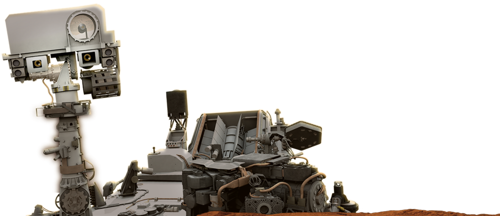

# JavaFX-Mars

Curiosity is a car-sized Mars rover designed to explore the Gale crater on Mars as part of NASA's Mars Science Laboratory mission. 
This JavaFX App allow user to get pictures taken by Curiosity. The app use NASA free API's for Mars Rover Photos.

There is a known issue:
There is a lag in transition between scenes due to background API calls

